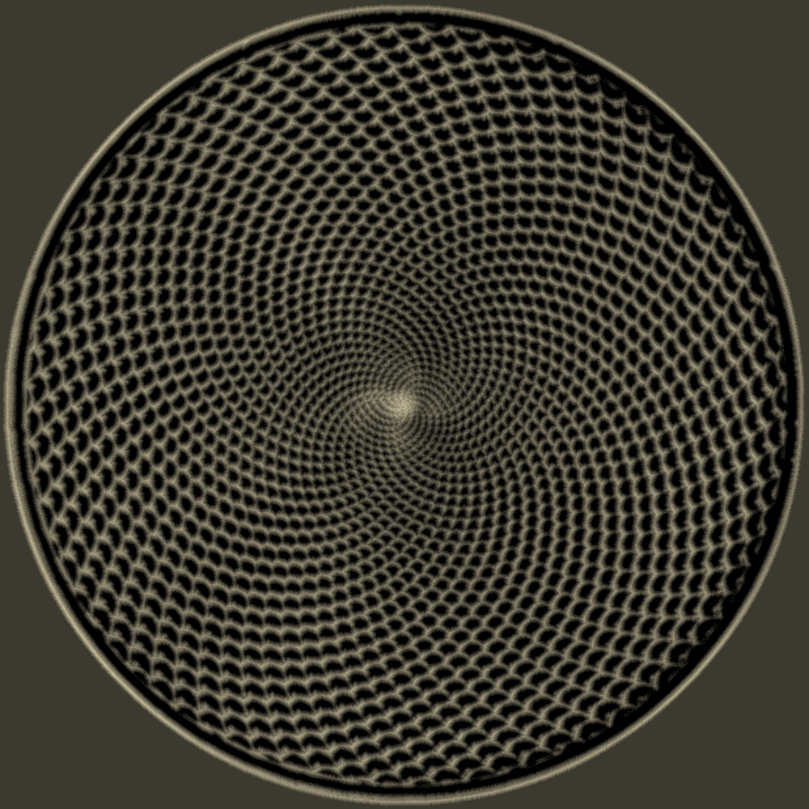

# ShowTHR

Reads one or more THR files and simulates the motion of a ball rolling over a table covered in sand.

This is a fork of xxxx’s ShowTHR, which had some really great code.  I wanted to add a bunch of features, but rather than staying in Java & Manven, I decided to migrate the codebase to Kotlin, and the build platform to Gradle. 

## Highlights
- Simple default UI lets you watch the track being drawn in real time!  Or, use the `-headless` flag to suppress the UI display. 
- Draw any .thr file - or several .thr files sequentially, or have them overwrite each other, just like a real Sisyphus table.
- 1 ball (default)
- 2 balls (Tantalus mode)
- 2nd ball only in Tantalus mode (no first ball)
- Reversed order of tracks
- Any image size output
- Variable ball sizes, sand depth
- Use any image as a background, or generate your own “clean track” images 
- 

## Usage

Get the [Release](https://github.com/dbulla/ShowTHR/releases) version, or build it yourself from source code after creating the shadow jar (a single jar with all code and libraries) file with Gradle: ```./gradlew shadowJar```.

Then, you can run it from the command line :

```java -jar build/libs/ShowTHR-all.jar -i <inputFile.thr> [options]``` or ```java -jar build/libs/ShowTHR-all.jar -i <inputFile.thr> [options]```

Better yet, just run it via Gradle - just wrap the args like so: 

```./gradlew run --args="-i <inputFile.thr> [options]```

where `<xxx>` requires a value and `[xxxxx]` are optional

Mandatory flags:

| Option   | Type   | Meaning                                                               |
|----------|--------|-----------------------------------------------------------------------|
| ```-i``` | String | Mandatory (unless ```-clean``` is used), name of the .thr file to use |

Optional flags that require arguments:

| Option               | Type   | Meaning                                                                                                                                                                                                          |
|----------------------|--------|------------------------------------------------------------------------------------------------------------------------------------------------------------------------------------------------------------------|
| ```-o```             | String | If present, the output file will be written to this file name                                                                                                                                                    |
| ```-background```    | String | Use the supplied image as the background image.  Will be blank if it doesn't exist.  Uses `clean_SIZE.png` if not supplied, where the `SIZE` is the table size                                                   |
| ```-depth```         | Int    | Initial depth of the sand.  Default is 2.  Ignored if you have a background image                                                                                                                                |
| ```-deltaTime```     | Int    | Determines how fine the time slice is - the smaller the number, the slower (but smoother) the animation.  Default is 2.  If you use Tantalus mode and see ball 2 'skipping', try setting this below the default. |
| ```-skip```          | Int    | How many track lines are skipped before the image is refreshed - 1 is slowest, higher is faster (but jerkier)                                                                                                    |
| ```-ballRadius```    | Int    | Sets the ball size.  Default is 5                                                                                                                                                                                |
| ```-tableDiameter``` | Int    | Sets the diameter of the sand table.  Default is the screen height if not specified                                                                                                                              |
| ```-batchTracks```   | String | List of file names to process, separated by commas - each will draw on top of the previous one                                                                                                                   |

Optional flags without arguments:

| Option           | Meaning                                                                                                                        |
|------------------|--------------------------------------------------------------------------------------------------------------------------------|
| ```-clean```     | If present, will generate a `clean_SIZE.png` image to be used as a background image.  Use with ```-tableDiameter```            |
| ```-quit```      | If present, the program will quit after it has saved the image to file.  Else, it will stop with the image displayed (default) |
| ```-reversed```  | If present, the .thr file will be read in reversed order                                                                       |
| ```tantalus```   | Tantalus mode - draw with two balls!                                                                                           |
| ```-grey```      | Use a grey background instead of a "clean" track background                                                                    |
| ```-headless```  | Generate the image w/o any GUI, exits after the image is saved to disk                                                         |
| ```-hideBall1``` | If present, the first ball will not be drawn (used with ```-tantalus```)                                                       |
| ```-expand```    | ExpandSequences -  If true (default), will preprocess the .thr file to deal with polar->x,y conversion issues                  |
| ```-center```    | If present, will ignore the previous position of the UI and instead center the UI in the display                               |


## Example

```./gradlew run --args= "-i src/test/resources/clockworkSwirl5WithClipping.thr" -tableDiameter 1000```

should produce the following:



## Table Geometry
- The table is round, with polar coordinates that put 0,0 at the center. 
- The sand matrix is represented as a 2D array of points – that goes from `0` to `tableDiameter`, with (0, 0) at the corner.  The table has a 20-pixel inset border, so the sand doesn’t just vanish if it gets pushed beyond rho of 1.0, which is how it works in a real table.
- The image itself is a 2D array of pixels – that goes from 0 to table diameter - with (0,0) at the top left corner.  The height of each sand matrix element is converted into an RGB value, and stored into the image.
  - Every line of the `.thr` file gets the image displayed to the UI.  If that’s too slow, you can add a `-skip X` flag with a value of 10 or more (default is 4).  This will “skip” image generation and display for however many lines you specify.  The higher the value, the faster the drawing takes, but it can be jerkier.
  - Similarly, the `-deltaTime X` flag can make the app slice each ball movement into finer time slices, which will slow things down.  

- Although the tracks are lists of theta-rho values, these have to be converted to x-y coordinates for computational purposes.


## Tantalus mode
You can simulate having 2 balls with the "`-tantalus`" flag.  The first ball is the "normal" 
ball, the second is on the opposite side of the arm.  You can even remove the main ball with “`-hideBall1`” flag.


## Notes

The intensity of the output image is dictated by the highest peak in the sand simulation.  The output image is normalized to the range [0, 255].

If one point of sand is very tall, the rest of the image will be very dark.

## Todos

- Get rid of script to browse dirs, add option to do it from the app?
- Add the ability to save all images and make an animation from them


## License

Apache 2.0 License
