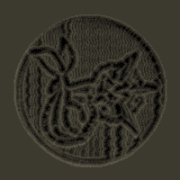
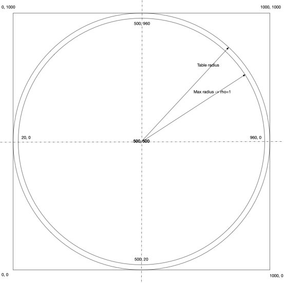

# ShowTHR

Read a THR file and simulate the motion of a ball rolling over a table covered in sand.

## Usage

Get the [Release](https://github.com/MarginallyClever/ShowTHR/releases) version or build it yourself from source code.
Run it from the command line:

```java -jar ShowTHR.jar <source.thr> <output> [-w <width>] [-h <height>] [-d <depth>] [-b <radius>]```

where `<requires a value>` and `[optional parts]`

- `<source.thr>`: The path to the THR file.
- `<output>`: The path to the output file.  ImageIO supported formats are accepted, including pio and webp.
- `-w <width>`: The width of the output image.  Default is 300.
- `-h <height>`: The height of the output image.  Default is 300.
- `-b <radius>`: The radius of the ball.  Default is 5.
- `-d <depth>`: The starting depth of the sand.  Default is 2.

## Example

```java -jar ShowTHR.jar "src/test/resources/Vaporeon with Waves.thr" sand_simulation.png -w 1000 -h 1000```

should produce the following:



## Table Geometry
- The table is round, with polar coordinates that puts 0,0 at the center. 
- The sand matrix is represented as a 2D array of points - that goes from -1/2 table diameter + padding to 1/2 table diameter + padding - with (0, 0) at it's center.
- However, the image itself is a 2D array of pixels - that goes from 0 to table diameter + 2*padding - with (0,0) at the top left corner.

- So, although the tracks are lists of theta-rho values, these have to be converted to x,y coordinates for computational purposes.

Making things tougher is that the table has a "shoulder" outside of rho=1.  So, the sand is 
slightly larger than the table we wanted (by 20 pixels, so if we'd asked for a 1000 pixels-wide table, we actually get 1040 to handle the overflow), and we have to take that into account, too.

The fact that the image comes out a little larger is because of the padding.  TODO - subtract the padding from the table diameter when inputting.



## Tantalus mode
You can simulate having 2 balls with the "-useTwoBalls" flag.  The first ball is the "normal" 
ball, the second is on the opposite side of the arm.


## Notes

The intensity of the output image is dictated by the highest peak in the sand simulation.  The output image is normalized to the range [0, 255].
If one point of sand is very tall, the rest of the image will be very dark.

## License

Apache 2.0 License
