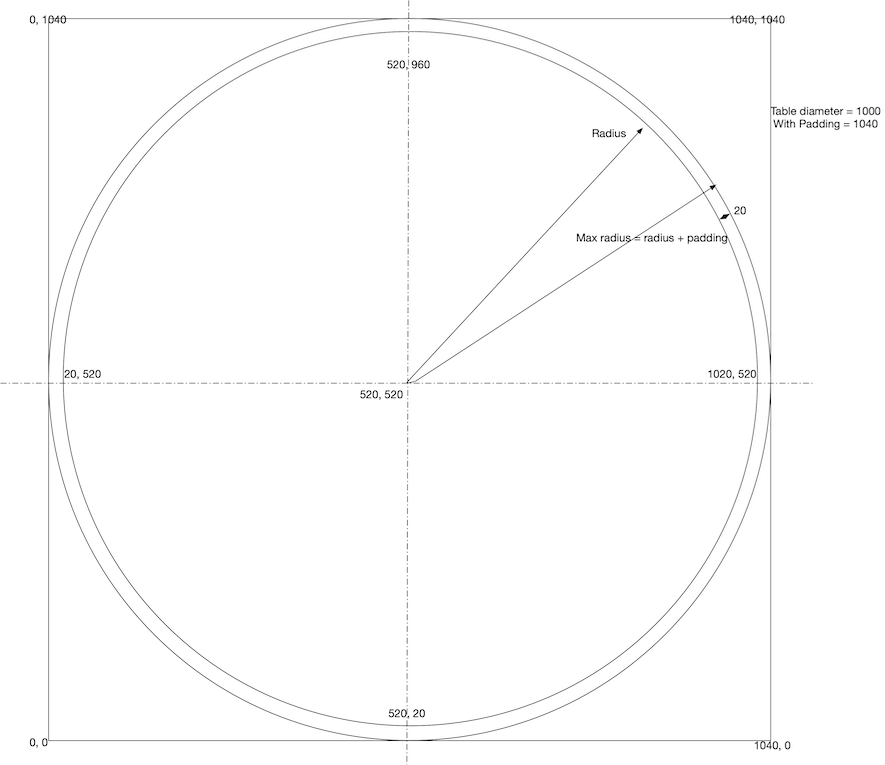

# ShowTHR

Read a THR file and simulate the motion of a ball rolling over a table covered in sand.

## Usage

Get the [Release](https://github.com/dbulla/ShowTHR/releases) version or build it yourself from source code after creating the jar file with Gradle: ```./gradlew shadowJar```.
Then, run it from the command line :

```java -jar ShowTHR-all.jar -i <inputFile.thr> [options]``` or ```java -jar build/libs/ShowTHR-all.jar -i <inputFile.thr> [options]```

Better yet, just run via Gradle: 
```./gradlew run --args="-i <inputFile.thr> [options]```

where `<requires a value>` and `[optional parts]`

Optional flags with arguments:

| Option               | Type   | Meaning                                                                                                                 |
|----------------------|--------|-------------------------------------------------------------------------------------------------------------------------|
| ```-i```             | String | Mandatory, name of the .thr track to read in                                                                            |
| ```-o```             | String | If present, the output file will be written to this file name                                                           |
| ```-background```    | String | Use the supplied image as the background image.  Will be blank if it doesn't exist.  Uses "clean.png" if not supplied.  |
| ```-depth```         | Int    | Initial depth of the sand.  Default is 2.  Ignored if you have a background image.                                      |
| ```-deltaTime```     | Int    | Determines how fine the time slice is - the smaller the number, the slower (but smoother) the animation.  Default is 2. |
| ```-skip```          | Int    | How many lines are skipped before the image is refreshed - 1 is slowest, higher is faster (but jerkier)                 |
| ```-ballRadius```    | Int    | Sets the ball size.  Default is 5.                                                                                      |
| ```-tableDiameter``` | Int    | Sets the diameter of the sand table.  Default is the screen height                                                      |
| ```-batchTracks```   | String | List of file names to process, separated by commas - each will draw on top of the previous one.                         |

Optional flags without arguments:

| Option           | Meaning                                                                                                                        |
|------------------|--------------------------------------------------------------------------------------------------------------------------------|
| ```-clean```     | If present, will generate a "clean_SIZE.png" image to be used as a background image.  Use with ```-tableDiameter```            |
| ```-quit```      | If present, the program will quit after it has saved the image to file.  Else, it will stop with the image displayed (default) |
| ```-reversed```  | If present, the .thr file will be read in reversed order.                                                                      |
| ```tantalus```   | Tantalus mode - draw with two balls!                                                                                           |
| ```-grey```      | Use a grey background instead of a "clean" track background.                                                                   |
| ```-headless```  | Generate the image w/o any GUI, exits after the image is saved to disk                                                         |
| ```-hideBall1``` | If present, the first ball will not be drawn (used with ```-tantalus```)                                                       |
| ```-expand```    | ExpandSequences -  If true (default), will preprocess the .thr file to deal with polar->x,y conversion issues                  |


## Example

```./gradlew run --args= "-i src/test/resources/clockworkSwirl5WithClipping.thr" -tableDiameter 1000```

should produce the following:

## Table Geometry
- The table is round, with polar coordinates that put 0,0 at the center. 
- The sand matrix is represented as a 2D array of points – that goes from -1/2 table diameter + padding to 1/2 table diameter + padding - with (0, 0) at it's center.
- However, the image itself is a 2D array of pixels – that goes from 0 to table diameter + 2*padding - with (0,0) at the top left corner.

- So, although the tracks are lists of theta-rho values, these have to be converted to x,y coordinates for computational purposes.

Making things tougher is that the table has a "shoulder" outside of rho=1.  So, the sand is 
slightly larger than the table we wanted (by 20 pixels, so if we'd asked for a 1000 pixels-wide table, we actually get 1040 to handle the overflow), and we have to take that into account, too.

The fact that the image comes out a little larger is because of the padding.  TODO - subtract the padding from the table diameter when inputting.



## Tantalus mode
You can simulate having 2 balls with the "-tantalus" flag.  The first ball is the "normal" 
ball, the second is on the opposite side of the arm.


## Notes

The intensity of the output image is dictated by the highest peak in the sand simulation.  The output image is normalized to the range [0, 255].
If one point of sand is very tall, the rest of the image will be very dark.

## License

Apache 2.0 License
